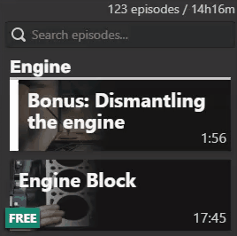
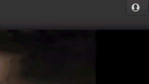
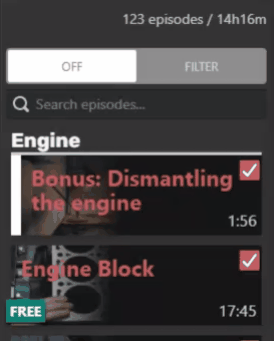

[![LinkedIn][linkedin-shield]][linkedin-url]

<!-- PROJECT LOGO -->
 

  

  <h3 align="center"><a href="https://howacarworks.com">howacarworks.com</a> bookmarks</h3>

  

    Google chrome extension that provides bookmarks for episodes
     
    <a href="https://github.com/borko-rajkovic/howacarworks-bookmarks/issues">Report Bug</a>
    ·
    <a href="https://github.com/borko-rajkovic/howacarworks-bookmarks/issues">Request Feature</a>
  

<!-- TABLE OF CONTENTS -->

## Table of Contents

- [About the Project](#about-the-project)
- [Contributing](#contributing)
- [Contact](#contact)

<!-- ABOUT THE PROJECT -->

## About The Project

**howacarworks.com bookmarks** is the Google Chrome extension that allows to use bookmarks on episodes.

### Before

### After

<!-- CONTRIBUTING -->

## Contributing

Contributions are what make the open source community such an amazing place to learn, inspire, and create. Any contributions you make are **greatly appreciated**.

1. Fork the Project
2. Create your Feature Branch (`git checkout -b feature/AmazingFeature`)
3. Commit your Changes (`git commit -m 'Add some AmazingFeature`)
4. Push to the Branch (`git push origin feature/AmazingFeature`)
5. Open a Pull Request

<!-- CONTACT -->

## Contact

Borko Rajkovic - [LinkedIn](https://linkedin.com/in/borko-rajkovic) - rajkovicborko@gmail.com

<!-- MARKDOWN LINKS & IMAGES -->

[linkedin-shield]: https://img.shields.io/badge/-LinkedIn-black.svg?style=flat-square&logo=linkedin&colorB=555
[linkedin-url]: https://linkedin.com/in/borko-rajkovic/
